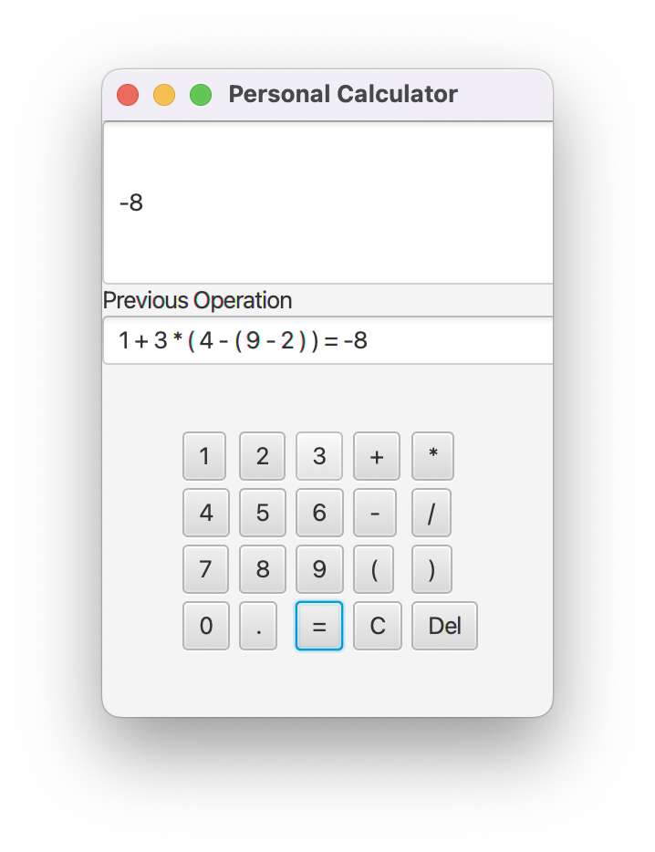

## Calculator

## Description
This application is built when I took programming 2 course.

I create an calculator used recursive algorithm.

Let take an example of arithmetic expression ```1 + 3 * (4 - (9 - 2))```

Firstly, I separate operand's privilege like this ```() > * / > + -```

Next, I calculate in order from the most highest to the lowest privilege of expression. In this expression above will (9-2) and recur like that until remain only on number.

## Run code
Because only java8 support for javafx, so use need switch to java8 before run ```javac Calculator.java```

## Result
